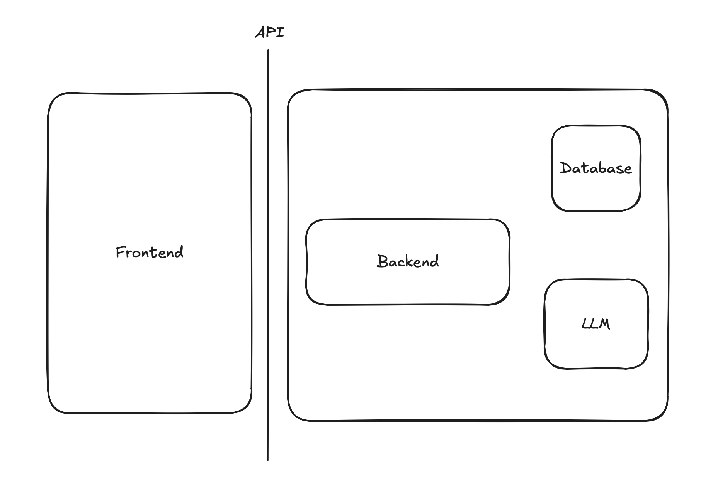
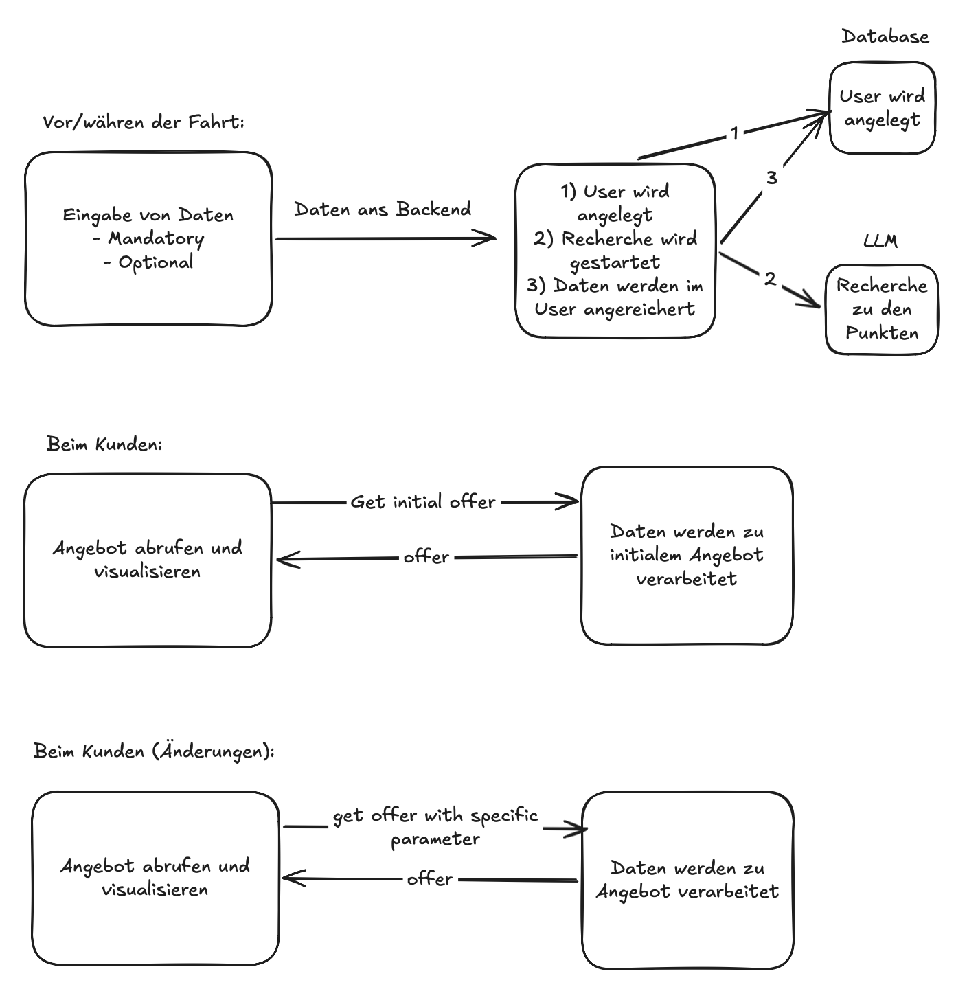
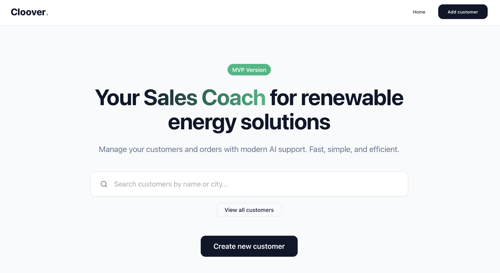
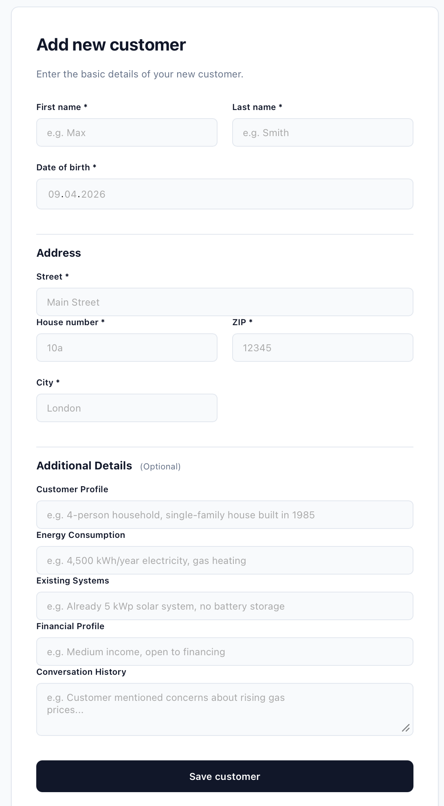
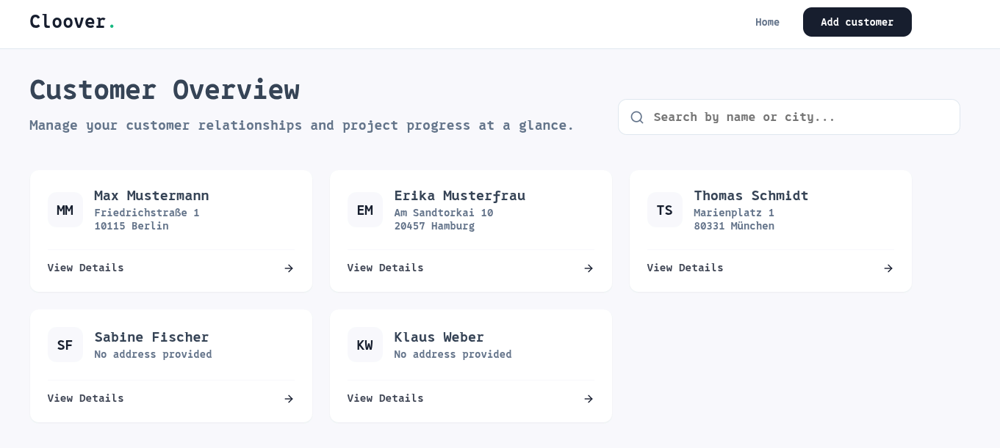
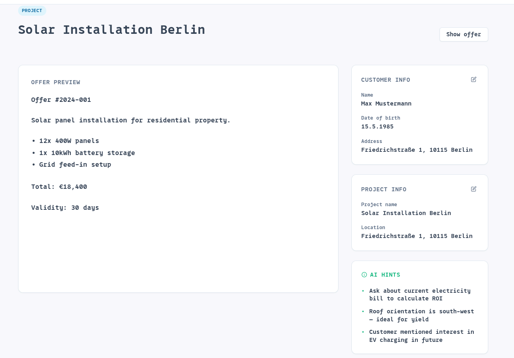

# q-hack-cloover
Submission of the q-hackathon cloover challenge 2026

# Der KI-Verkaufscoach für Installateure erneuerbarer Energien

## Das Problem

Imagine you’re a sales representative at a company that installs solar panels and heat pumps for residential customers in Germany. A new lead comes in—a homeowner in a small town two hours south of Frankfurt. You know his name, his address, and that he clicked on a heat pump ad. That’s it.

## How we understood the problem
- The customer wants a solution as soon as possible but has no idea about:
  -  Products
  -  Market conditions
  -  Installation time and scope
  -  Laws and incentives
  -  What information an installer needs
- Sales reps need as much relevant installation data as possible
  -  They frequently visit customers but are unable to finalize a quote due to missing data
  -  Filling in the necessary installation information is a difficult and time-consuming process
- The sales representative is on the way to meet the customer, and their AI sales coach assistant is giving them final tips
- Once there, the end customer and the sales representative will go through various scenarios based on a range of offer options, without having to wait for data to be populated by entering optional information

- The salesperson is presented with various options and questions

## A brief demonstration of the demo
We decided to go with a Svelte + Kotlin + PostgreSQL stack

## Key assumptions we have made
- The customer has already expressed interest in a specific product category
- Geodata such as solar factor and heat pump suitability (surface area or depth) are available for Germany and can be queried directly for a property address
- For subsidies, only German laws and subsidies apply
- Product prices, availability, and information are available on demand 

## Potential impact of widespread use
- Customers are asked more targeted questions
- Customers have greater confidence in the process
- Customers have a more realistic understanding of the installation
- Installers have greater planning certainty
- The energy transition can proceed more quickly

## Problems
- The AI's API token for backend implementation was constantly invalid
- AI credits were immediately invalid
- Internet bandwidth was no longer sufficient
